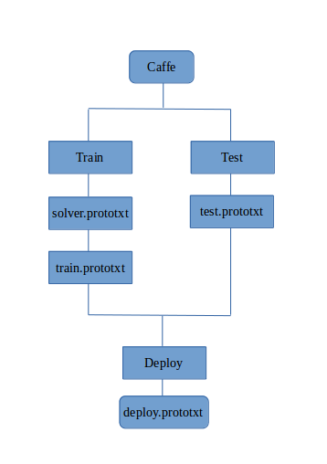
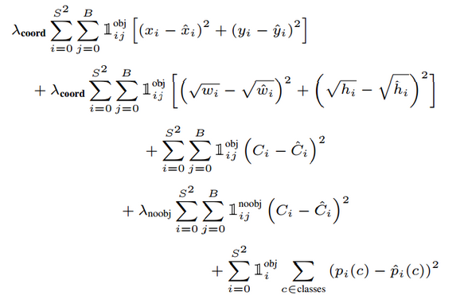
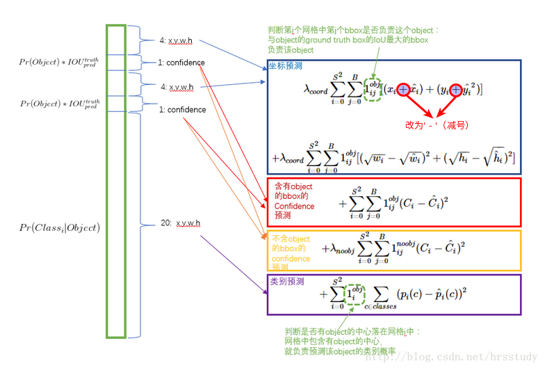
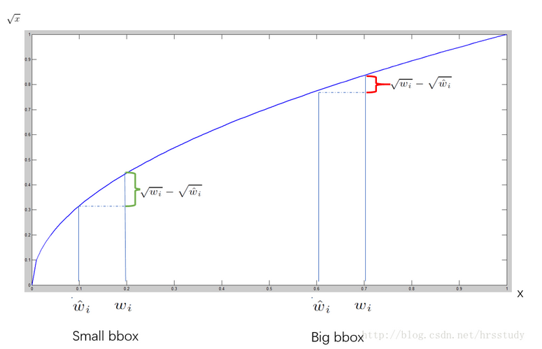

**本博文记录博主对caffe的初步理解以及yolo在caffe上的运行**

## 一、数据处理篇
### 1.1 Dataset转化为LMDB
&nbsp;&nbsp;&nbsp;&nbsp;如先前所做的总结，在这里再次强调一下，首先要将数据转化为LMDB或LEVELDB格式，再输入至caffe的数据输入层。而图片转化为LMDB格式时，其形状或维度含义为[heights, weights, channels] 。其代码（位于caffe/src/caffe/util/io.cpp）如下:
``` c++
void CVMatToDatum(const cv::Mat& cv_img, Datum* datum) {a  CHECK(cv_img.depth() == CV_8U) << "Image data type must be unsigned byte";
  datum->set_channels(cv_img.channels());
  datum->set_height(cv_img.rows);
  datum->set_width(cv_img.cols);
  datum->clear_data();
  datum->clear_float_data();
  datum->set_encoded(false);
  int datum_channels = datum->channels();
  int datum_height = datum->height();
  int datum_width = datum->width();
  int datum_size = datum_channels * datum_height * datum_width;
  std::string buffer(datum_size, ' ');
  for (int h = 0; h < datum_height; ++h) {
    const uchar* ptr = cv_img.ptr<uchar>(h);
    int img_index = 0;
    for (int w = 0; w < datum_width; ++w) {
      for (int c = 0; c < datum_channels; ++c) {
        int datum_index = (c * datum_height + h) * datum_width + w;
        buffer[datum_index] = static_cast<char>(ptr[img_index++]);
      }
    }
  }
  datum->set_data(buffer);
}
```

而label文件对bounding-box的标记也从[Xmin, Ymin, Xmax, Ymax] 转化为[Xmid, Ymid, W, H]，同时，对其进行了归一化操作；并将不同class转为对应的index（按照label_map进行`映射）。其代码（位于caffe/src/caffe/util/io.cpp）如下:

``` c++
void ParseXmlToDatum(const string& annoname, const map<string, int>& label_map,
    int ori_w, int ori_h, Datum* datum) {
  ptree pt;
  read_xml(annoname, pt);
  int width(0), height(0);
  try {
    height = pt.get<int>("annotation.size.height");
    width = pt.get<int>("annotation.size.width");
    CHECK_EQ(ori_w, width);
    CHECK_EQ(ori_h, height);
  } catch (const ptree_error &e) {
    LOG(WARNING) << "When paring " << annoname << ": " << e.what();
  }
  datum->clear_float_data();
  BOOST_FOREACH(ptree::value_type &v1, pt.get_child("annotation")) {
    if (v1.first == "object") {
      ptree object = v1.second;
      int label(-1);
      vector<float> box(4, 0);
      int difficult(0);
      BOOST_FOREACH(ptree::value_type &v2, object.get_child("")) {
        ptree pt2 = v2.second;
        if (v2.first == "name") {
          string name = pt2.data();
          // map name to label
          label = name_to_label(name, label_map);
          if (label < 0) {
            LOG(FATAL) << "Anno file " << annoname << " -> unknown name: " << name;
          }
        } else if (v2.first == "bndbox") {
          int xmin = pt2.get("xmin", 0);
          int ymin = pt2.get("ymin", 0);
          int xmax = pt2.get("xmax", 0);
          int ymax = pt2.get("ymax", 0);
          LOG_IF(WARNING, xmin < 0 || xmin > ori_w) << annoname <<
              " bounding box exceeds image boundary";
          LOG_IF(WARNING, xmax < 0 || xmax > ori_w) << annoname <<
              " bounding box exceeds image boundary";
          LOG_IF(WARNING, ymin < 0 || ymin > ori_h) << annoname <<
              " bounding box exceeds image boundary";
          LOG_IF(WARNING, ymax < 0 || ymax > ori_h) << annoname <<
              " bounding box exceeds image boundary";
          LOG_IF(WARNING, xmin > xmax) << annoname <<
              " bounding box exceeds image boundary";
          LOG_IF(WARNING, ymin > ymax) << annoname <<
              " bounding box exceeds image boundary";
          box[0] = float(xmin + (xmax - xmin) / 2.) / ori_w;
          box[1] = float(ymin + (ymax - ymin) / 2.) / ori_h;
          box[2] = float(xmax - xmin) / ori_w;
          box[3] = float(ymax - ymin) / ori_h;
        } else if (v2.first == "difficult") {
          difficult = atoi(pt2.data().c_str());
        }
      }
      CHECK_GE(label, 0) << "label must start at 0";
      datum->add_float_data(float(label));
      datum->add_float_data(float(difficult));
      for (int i = 0; i < 4; ++i) {
        datum->add_float_data(box[i]);
      }
    }
  }
}
```
### 1.2 DataLayer
yolo网络训练、测试时所用的DataLayer是BoxDataLayer，该数据输入层是由caffe-yolo原作者编写。这里做一下简单的代码分析：

``` c++
#ifdef USE_OPENCV
#include <opencv2/core/core.hpp>
#endif  // USE_OPENCV
#include <stdint.h>

#include <vector>

#include "caffe/data_transformer.hpp"
#include "caffe/layers/box_data_layer.hpp"
#include "caffe/util/benchmark.hpp"

namespace caffe {
//构造函数，初始化Layer参数，reader_参数; BasePrefetchingDataLayer带预取功能的数据读取层
template <typename Dtype>
BoxDataLayer<Dtype>::BoxDataLayer(const LayerParameter& param)
  : BasePrefetchingDataLayer<Dtype>(param),
    reader_(param) {
}
//解析函数
template <typename Dtype>
BoxDataLayer<Dtype>::~BoxDataLayer() {
  this->StopInternalThread();
}
//BoxDataLayer层设置
template <typename Dtype>
void BoxDataLayer<Dtype>::DataLayerSetUp(const vector<Blob<Dtype>*>& bottom,
      const vector<Blob<Dtype>*>& top) {
  this->box_label_ = true;
  const DataParameter param = this->layer_param_.data_param();
  const int batch_size = param.batch_size();
  // 读取数据，并使用它来初始化blob的top。
  Datum& datum = *(reader_.full().peek());

  // 使用data_transformer从datum得到预期的blob形状。
  vector<int> top_shape = this->data_transformer_->InferBlobShape(datum);
  this->transformed_data_.Reshape(top_shape);
  // Reshape top[0] and prefetch_data according to the batch_size.
  top_shape[0] = batch_size;
  top[0]->Reshape(top_shape);
  //PREFETCH_COUNT-预取的数据批量数目
  for (int i = 0; i < this->PREFETCH_COUNT; ++i) {
    this->prefetch_[i].data_.Reshape(top_shape);
  }
  LOG(INFO) << "output data size: " << top[0]->num() << ","
      << top[0]->channels() << "," << top[0]->height() << ","
      << top[0]->width();
  // label
  if (this->output_labels_) {
    if (param.side_size() > 0) {
      for (int i = 0; i < param.side_size(); ++i) {
        sides_.push_back(param.side(i));
      }
    }
    if (sides_.size() == 0) {
      sides_.push_back(7);
    }
    CHECK_EQ(sides_.size(), top.size() - 1) <<
      "side num not equal to top size";
    for (int i = 0; i < this->PREFETCH_COUNT; ++i) {
      this->prefetch_[i].multi_label_.clear();
    }
    for (int i = 0; i < sides_.size(); ++i) {
      vector<int> label_shape(1, batch_size);
      int label_size = sides_[i] * sides_[i] * (1 + 1 + 1 + 4);
      label_shape.push_back(label_size);
      top[i+1]->Reshape(label_shape);
      for (int j = 0; j < this->PREFETCH_COUNT; ++j) {
        shared_ptr<Blob<Dtype> > tmp_blob;
        tmp_blob.reset(new Blob<Dtype>(label_shape));
        this->prefetch_[j].multi_label_.push_back(tmp_blob);
      }
    }
  }
}

// This function is called on prefetch thread
// 批量导入数据
template<typename Dtype>
void BoxDataLayer<Dtype>::load_batch(Batch<Dtype>* batch) {
  CPUTimer batch_timer;
  batch_timer.Start();
  double read_time = 0;
  double trans_time = 0;
  CPUTimer timer;
  CHECK(batch->data_.count());
  CHECK(this->transformed_data_.count());

  // Reshape according to the first datum of each batch
  // on single input batches allows for inputs of varying dimension.
  const int batch_size = this->layer_param_.data_param().batch_size();
  Datum& datum = *(reader_.full().peek());
  // Use data_transformer to infer the expected blob shape from datum.
  vector<int> top_shape = this->data_transformer_->InferBlobShape(datum);
  this->transformed_data_.Reshape(top_shape);
  // Reshape batch according to the batch_size.
  top_shape[0] = batch_size;
  batch->data_.Reshape(top_shape);

  Dtype* top_data = batch->data_.mutable_cpu_data();
  vector<Dtype*> top_label;

  if (this->output_labels_) {
    for (int i = 0; i < sides_.size(); ++i) {
      top_label.push_back(batch->multi_label_[i]->mutable_cpu_data());
    }
  }
  for (int item_id = 0; item_id < batch_size; ++item_id) {
    timer.Start();
    // get a datum
    Datum& datum = *(reader_.full().pop("Waiting for data"));
    read_time += timer.MicroSeconds();
    timer.Start();
    // Apply data transformations (mirror, scale, crop...)
    int offset = batch->data_.offset(item_id);
    vector<BoxLabel> box_labels;
    this->transformed_data_.set_cpu_data(top_data + offset);
    if (this->output_labels_) {
      // rand sample a patch, adjust box labels
      this->data_transformer_->Transform(datum, &(this->transformed_data_), &box_labels);
      // transform label
      for (int i = 0; i < sides_.size(); ++i) {
        int label_offset = batch->multi_label_[i]->offset(item_id);
        int count  = batch->multi_label_[i]->count(1);
        transform_label(count, top_label[i] + label_offset, box_labels, sides_[i]);
      }
    } else {
      this->data_transformer_->Transform(datum, &(this->transformed_data_));
    }
    trans_time += timer.MicroSeconds();

    reader_.free().push(const_cast<Datum*>(&datum));
  }
  timer.Stop();
  batch_timer.Stop();
  DLOG(INFO) << "Prefetch batch: " << batch_timer.MilliSeconds() << " ms.";
  DLOG(INFO) << "     Read time: " << read_time / 1000 << " ms.";
  DLOG(INFO) << "Transform time: " << trans_time / 1000 << " ms.";
}
//生成通过数据转化器生成的数据对应的label
template<typename Dtype>
void BoxDataLayer<Dtype>::transform_label(int count, Dtype* top_label,
    const vector<BoxLabel>& box_labels, int side) {
  int locations = pow(side, 2);
  CHECK_EQ(count, locations * 7) <<
    "side and count not match";
  // difficult
  caffe_set(locations, Dtype(0), top_label);
  // isobj
  caffe_set(locations, Dtype(0), top_label + locations);
  // class label
  caffe_set(locations, Dtype(-1), top_label + locations * 2);
  // box
  caffe_set(locations*4, Dtype(0), top_label + locations * 3);
  for (int i = 0; i < box_labels.size(); ++i) {
    float difficult = box_labels[i].difficult_;
    if (difficult != 0. && difficult != 1.) {
      LOG(WARNING) << "Difficult must be 0 or 1";
    }
    float class_label = box_labels[i].class_label_;
    CHECK_GE(class_label, 0) << "class_label must >= 0";
    float x = box_labels[i].box_[0];
    float y = box_labels[i].box_[1];
    // LOG(INFO) << "x: " << x << " y: " << y;
    int x_index = floor(x * side);
    int y_index = floor(y * side);
    x_index = std::min(x_index, side - 1);
    y_index = std::min(y_index, side - 1);
    int dif_index = side * y_index + x_index;
    int obj_index = locations + dif_index;
    int class_index = locations * 2 + dif_index;
    int cor_index = locations * 3 + dif_index * 4;
    top_label[dif_index] = difficult;
    top_label[obj_index] = 1;
    // LOG(INFO) << "dif_index: " << dif_index << " class_label: " << class_label;
    top_label[class_index] = class_label;
    for (int j = 0; j < 4; ++j) {
      top_label[cor_index + j] = box_labels[i].box_[j];
    }
  }
}
//实例化BoxDataLayer、BoxData
INSTANTIATE_CLASS(BoxDataLayer);
REGISTER_LAYER_CLASS(BoxData);

}  // namespace caffe
```
### 1.3 Input与预处理
&nbsp;&nbsp;&nbsp;&nbsp;在进行图像预处理时，可以使用去均值操作，其目的是使得像素值更接近（0,0,0）原点，从而加快收敛速度。如果在数据层加入去均值操作，预测时也需要进行去均值操作。如无，则无需！其方法如下：
``` 
//(104,117,123)为imagenet均值，可自行根据数据集生成均值。
mean_value: 104
mean_value: 117
mean_value: 123
```
&nbsp;&nbsp;&nbsp;&nbsp;同时，图像预处理的目的之一是保证输入数据与网络输入层所要求的shape保持一致。通过opencv.imread(img_path)函数读取的图片为（heights, weights, channels）。而deploy.prototxt中的input层为（channels, heights, weights）。因此，在进行预测时需要对输入图片进行预处理。
``` python
im = cv2.imread(im_path)
im = cv2.resize(im, (160, 160))
im = np.require(im.transpose((2, 0, 1)), dtype=np.float32)
#在训练时没有进行去均值，因此在预测时也没有进行去均值。
#im -= mean
```
而转化为graph文件后，其网络输入层为（heights, weights, channels），附件为转为graph文件后的网络结构图：
[点击查看或下载](output.gv.svg)
因此，无需对输入图片进行预处理：
``` bash
im = cv2.imread(input_image_path)
im = cv2.resize(im, (160, 160))
```

## 二、caffe简介
### 2.1 Project结构
&nbsp;&nbsp;&nbsp;&nbsp;在caffe架构下搭建网络是通过prototxt文件描述的，以此建立统一的参数管理机制。在prototxt文件中，不仅包含基本的网络结构，还包含Loss层（Train时需要）、输入数据的路径和结构（Train与Test时需要）、输入数据size/ shape（如160*160*3,Deploy时需要）。因此，不同于keras，caffe的网络结构文件需要多个。
&nbsp;&nbsp;&nbsp;&nbsp;首先，solver.prototxt（即求解器）的主要功能是设置超参数，确定优化方式；其次， train.prototxt与test.prototxt的主要功能是搭建网络结构，设置结构参数用于训练与测试，确定loss层；最后，deploy.prototxt的主要功能是搭建最基础的网络结构用于预测。

### 2.2 网络结构
deploy.prototxt内容如下：
``` bash
name: "tiny-yolo"
input: "data"
input_shape {
  dim: 1
  dim: 3
  dim: 160
  dim: 160
}
layer {
  name: "conv1"
  type: "Convolution"
  bottom: "data"
  top: "conv1"
  convolution_param {
    num_output: 16
    kernel_size: 3
    pad: 1
    bias_term: false
  }
}
layer {
  name: "bn1"
  type: "BatchNorm"
  bottom: "conv1"
  top: "bn1"
  batch_norm_param {
    use_global_stats: true
  }
}
layer {
  name: "scale1"
  type: "Scale"
  bottom: "bn1"
  top: "scale1"
  scale_param {
    bias_term: true
  }
}
layer {
  name: "relu1"
  type: "ReLU"
  bottom: "scale1"
  top: "scale1"
  relu_param {
    negative_slope: 0.1
  }
}
layer {
  name: "pool1"
  type: "Pooling"
  bottom: "scale1"
  top: "pool1"
  pooling_param {
    pool: MAX
    kernel_size: 2
    stride: 2
  }
}
layer {
  name: "conv2"
  type: "Convolution"
  bottom: "pool1"
  top: "conv2"
  convolution_param {
    num_output: 32
    kernel_size: 3
    pad: 1
    bias_term: false
  }
}
layer {
  name: "bn2"
  type: "BatchNorm"
  bottom: "conv2"
  top: "bn2"
  batch_norm_param {
    use_global_stats: true
  }
}
layer {
  name: "scale2"
  type: "Scale"
  bottom: "bn2"
  top: "scale2"
  scale_param {
    bias_term: true
  }
}
layer {
  name: "relu2"
  type: "ReLU"
  bottom: "scale2"
  top: "scale2"
  relu_param {
    negative_slope: 0.1
  }
}
layer {
  name: "pool2"
  type: "Pooling"
  bottom: "scale2"
  top: "pool2"
  pooling_param {
    pool: MAX
    kernel_size: 2
    stride: 2
  }
}
layer {
  name: "conv3"
  type: "Convolution"
  bottom: "pool2"
  top: "conv3"
  convolution_param {
    num_output: 64
    kernel_size: 3
    pad: 1
    bias_term: false
  }
}
layer {
  name: "bn3"
  type: "BatchNorm"
  bottom: "conv3"
  top: "bn3"
  batch_norm_param {
    use_global_stats: true
  }
}
layer {
  name: "scale3"
  type: "Scale"
  bottom: "bn3"
  top: "scale3"
  scale_param {
    bias_term: true
  }
}
layer {
  name: "relu3"
  type: "ReLU"
  bottom: "scale3"
  top: "scale3"
  relu_param {
    negative_slope: 0.1
  }
}
layer {
  name: "pool3"
  type: "Pooling"
  bottom: "scale3"
  top: "pool3"
  pooling_param {
    pool: MAX
    kernel_size: 2
    stride: 2
  }
}

layer {
  name: "conv4"
  type: "Convolution"
  bottom: "pool3"
  top: "conv4"
  convolution_param {
    num_output: 128
    kernel_size: 3
    pad: 1
    bias_term: false
  }
}
layer {
  name: "bn4"
  type: "BatchNorm"
  bottom: "conv4"
  top: "bn4"
  batch_norm_param {
    use_global_stats: true
  }
}
layer {
  name: "scale4"
  type: "Scale"
  bottom: "bn4"
  top: "scale4"
  scale_param {
    bias_term: true
  }
}
layer {
  name: "relu4"
  type: "ReLU"
  bottom: "scale4"
  top: "scale4"
  relu_param {
    negative_slope: 0.1
  }
}
layer {
  name: "pool4"
  type: "Pooling"
  bottom: "scale4"
  top: "pool4"
  pooling_param {
    pool: MAX
    kernel_size: 2
    stride: 2
  }
}
layer {
  name: "conv5"
  type: "Convolution"
  bottom: "pool4"
  top: "conv5"
  convolution_param {
    num_output: 256
    kernel_size: 3
    pad: 1
    bias_term: false
  }
}
layer {
  name: "bn5"
  type: "BatchNorm"
  bottom: "conv5"
  top: "bn5"
  batch_norm_param {
    use_global_stats: true
  }
}
layer {
  name: "scale5"
  type: "Scale"
  bottom: "bn5"
  top: "scale5"
  scale_param {
    bias_term: true
  }
}
layer {
  name: "relu5"
  type: "ReLU"
  bottom: "scale5"
  top: "scale5"
  relu_param {
    negative_slope: 0.1
  }
}
layer {
  name: "pool5"
  type: "Pooling"
  bottom: "scale5"
  top: "pool5"
  pooling_param {
    pool: MAX
    kernel_size: 2
    stride: 2
  }
}
layer {
  name: "conv6"
  type: "Convolution"
  bottom: "pool5"
  top: "conv6"
  convolution_param {
    num_output: 512
    kernel_size: 3
    pad: 1
    bias_term: false
  }
}
layer {
  name: "bn6"
  type: "BatchNorm"
  bottom: "conv6"
  top: "bn6"
  batch_norm_param {
    use_global_stats: true
  }
}
layer {
  name: "scale6"
  type: "Scale"
  bottom: "bn6"
  top: "scale6"
  scale_param {
    bias_term: true
  }
}
layer {
  name: "relu6"
  type: "ReLU"
  bottom: "scale6"
  top: "scale6"
  relu_param {
    negative_slope: 0.1
  }
}
layer {
  name: "pool6"
  type: "Pooling"
  bottom: "scale6"
  top: "pool6"
  pooling_param {
    pool: MAX
    kernel_size: 2
    stride: 2
  }
}
layer {
  name: "conv7"
  type: "Convolution"
  bottom: "pool6"
  top: "conv7"
  convolution_param {
    num_output: 1024
    kernel_size: 3
    pad: 1
    bias_term: false
  }
}
layer {
  name: "bn7"
  type: "BatchNorm"
  bottom: "conv7"
  top: "bn7"
  batch_norm_param {
    use_global_stats: true
  }
}
layer {
  name: "scale7"
  type: "Scale"
  bottom: "bn7"
  top: "scale7"
  scale_param {
    bias_term: true
  }
}
layer {
  name: "relu7"
  type: "ReLU"
  bottom: "scale7"
  top: "scale7"
  relu_param {
    negative_slope: 0.1
  }
}
layer {
  name: "conv8"
  type: "Convolution"
  bottom: "scale7"
  top: "conv8"
  convolution_param {
    num_output: 256
    kernel_size: 3
    pad: 1
    bias_term: false
  }
}
layer {
  name: "bn8"
  type: "BatchNorm"
  bottom: "conv8"
  top: "bn8"
  batch_norm_param {
    use_global_stats: true
  }
}
layer {
  name: "scale8"
  type: "Scale"
  bottom: "bn8"
  top: "scale8"
  scale_param {
    bias_term: true
  }
}
layer {
  name: "relu8"
  type: "ReLU"
  bottom: "scale8"
  top: "scale8"
  relu_param {
    negative_slope: 0.1
  }
}
layer {
  name: "fc9"
  type: "InnerProduct"
  bottom: "scale8"
  top: "fc9"
  inner_product_param {
    num_output: 300
  }
}
```

## 三、Tiny YOLO
**&nbsp;&nbsp;&nbsp;&nbsp;Tiny-YOLO是YOLO算法的简单实现。相比于YOLO算法，它的网络结构更浅，仅有9层。除此外，其理论基础与YOLO并无二致。**
### 3.1 Yolo Innovation
&nbsp;&nbsp;&nbsp;&nbsp;YOLO算法首创的实现了端到端的目标检测算法，是速度惊人、准确度较好的one-stage算法。YOLO算法将整张图片划分为SXS的grid，采用一次性预测所有格子所含目标的bounding-box、confidence以及P(object)和P(class|object)。
&nbsp;&nbsp;&nbsp;&nbsp;网络的输出结果为一个向量，size为：S * S * (B * 5 +C)。其中，S为划分网格数，B为每个网格负责目标个数，C为类别个数。其含义为：每个网格会对应B个边界框，边界框的宽高范围为全图，而中心点落于该网格；每个边界框对应一个置信度值，代表该处是否有物体及定位准确度（即Confidence = P(object) * IOU(predict-box, ground-truth)。）；每个网格对应C个概率，分别代表每个class出现的概率。
&nbsp;&nbsp;&nbsp;&nbsp;而YOLO是如何实现对输入图像的分格呢？
&nbsp;&nbsp;&nbsp;&nbsp;原作者巧妙地在最后预测层设置了S * S * (B * 5 +C)个神经元（该层为全连接层，在yolo2中该层为1*1的卷积层），通过训练将对应不同网格的ground-truth收敛到对应的网格的输出中。
### 3.2 Loss
&nbsp;&nbsp;&nbsp;&nbsp;损失函数的设计目标就是让坐标（x,y,w,h），confidence，classification 这个三个方面达到很好的平衡。简单的全部采用了sum-squared error loss来做这件事会有以下不足： 
首先，(num_side*4)维的localization error和(num_classes)维的classification error每一个维度产生的代价同等重要，这显然是不合理的。 
其次，如果一些栅格中没有object（一幅图中这种栅格很多），那么就会将这些栅格中的bounding box的confidence置为0，相比于较少的有object的栅格，这些不包含物体的栅格对梯度更新的贡献会远大于包含物体的栅格对梯度更新的贡献，这会导致网络不稳定甚至发散。
&nbsp;&nbsp;&nbsp;&nbsp;因此，YOLO采取了更有效的Loss函数。将loss函数分为3部分：第一，坐标预测是否准确(图片中书写有误，xy值与groundtruth应相减不因相加)；第二，有无object预测是否准确；第三，类别预测。


&nbsp;&nbsp;&nbsp;&nbsp;更重视8维的坐标预测，给这些损失前面赋予更大的loss weight, 记为 λcoord ,在pascal VOC训练中取5。对没有object的bbox的confidence loss，赋予小的loss weight，记为 λnoobj ，在pascal VOC训练中取0.5。有object的bbox的confidence loss 和类别的loss 的loss weight正常取1。
&nbsp;&nbsp;&nbsp;&nbsp;对不同大小的bbox预测中，相比于大bbox预测偏一点，小box预测偏相同的尺寸对IOU的影响更大。而sum-square error loss中对同样的偏移loss是一样。为了缓和这个问题，作者用了一个巧妙的办法，就是将box的width和height取平方根代替原本的height和width。 如下：small bbox的横轴值较小，发生偏移时，反应到y轴上的loss（下图绿色）比big box(下图红色)要大。

## 四、Train && Test
### 4.1 Optimization
本项目测试过SGD、momentum 、Adam。最终，Adam效果最佳。
### 4.2 solver.prototxt(Adam)
``` bash
net: "x_train.prototxt"
test_iter: 3000
test_interval: 32000
test_initialization: false
display: 20
average_loss: 100
lr_policy: "multifixed"
stagelr: 0.001
stagelr: 0.0001
stagelr: 0.00001
stagelr: 0.000001
stageiter: 520
stageiter: 16000
stageiter: 24000
stageiter: 32000
max_iter: 32000
momentum: 0.9
weight_decay: 0.0005
snapshot: 2000
snapshot_prefix: "./models/x_yolo"
solver_mode: GPU
```
### 4.3 train.prototxt
[点击下载](train.prototxt)

## 五、Predict
``` bash
#!/usr/bin/env python
import numpy as np
import cv2
import os

import sys
sys.path.insert(0, '/home/mc/Desktop/caffe/caffe/python/')

import caffe


###########################
#global variable set start#
###########################

num_classes = 2
num_anchors = 2
side = 5

net_proto = "./x_deploy.prototxt"
model_path = "./models/x_yolo_iter_32000.caffemodel"
im_path = '/home/mc/Desktop/caffe-yolo/data/yolo/VOCdevkit/VOC2018/JPEGImages/826.jpg'

###########################
#global variable set end..#
###########################


#environment sets
caffe.set_device(0)
caffe.set_mode_gpu()

#nms filter
def nms(boxes, thresh):
    x1 = boxes[:, 0] - boxes[:, 2] / 2.
    y1 = boxes[:, 1] - boxes[:, 3] / 2.
    x2 = boxes[:, 0] + boxes[:, 2] / 2.
    y2 = boxes[:, 1] + boxes[:, 3] / 2.
    scores = boxes[:, 4]
    areas = (x2 - x1 + 1) * (y2 - y1 + 1)
    order = scores.argsort()[::-1]
    keep = []
    while order.size > 0:
        i = order[0]
        keep.append(i)
        ix1 = np.maximum(x1[i], x1[order[1:]])
        iy1 = np.maximum(y1[i], y1[order[1:]])
        ix2 = np.minimum(x2[i], x2[order[1:]])
        iy2 = np.minimum(y2[i], y2[order[1:]])
        w = np.maximum(0.0, ix2-ix1+1)
        h = np.maximum(0.0, iy2-iy1+1)
        inter = w * h
        ovr = inter / (areas[i] + areas[order[1:]] - inter)
        inds = np.where(ovr <= thresh)[0]
        order = order[inds + 1]
    return boxes[np.require(keep), :]

#parse result
def parse_result(out_put):
    global num_classes
    global num_anchors
    global side
    locations = side ** 2
    boxes = np.zeros((num_anchors * locations, 6), dtype=np.float32)
    for i in range(locations):
        tmp_scores = out_put[i:num_classes*locations:locations]
        max_class_ind = np.argsort(tmp_scores)[-1]
        max_prob = np.max(tmp_scores)
        obj_index = num_classes * locations + i
        obj_scores = max_prob * out_put[obj_index:(obj_index+num_anchors*locations):locations]
        coor_index = (num_classes + num_anchors) * locations + i
        for j in range(num_anchors):
           boxes[i*num_anchors+j][5] = max_class_ind
           boxes[i*num_anchors+j][4] = obj_scores[j]
           box_index = coor_index + j * 4 * locations
           boxes[i*num_anchors+j][0] = (i % side + out_put[box_index + 0 * locations]) / float(side)
           boxes[i*num_anchors+j][1] = (i / side + out_put[box_index + 1 * locations]) / float(side)
           boxes[i*num_anchors+j][2] = out_put[box_index + 2 * locations] ** 2
           boxes[i*num_anchors+j][3] = out_put[box_index + 3 * locations] ** 2
    return nms(boxes, 0.5)

#show or write result_picture
def show_boxes(im_path, boxes, sthresh=0.5, hthresh=1, show=0):
    print (boxes.shape)
    im = cv2.imread(im_path)
    ori_w = im.shape[1]
    ori_h = im.shape[0]
    for box in boxes:
        if box[4] < sthresh:
            continue
        if box[4] > hthresh:
            continue
        print (box)
        box = box[:4]
        x1 = max(0, int((box[0] - box[2] / 2.) * ori_w))
        y1 = max(0, int((box[1] - box[3] / 2.) * ori_h))
        x2 = min(ori_w - 1, int((box[0] + box[2] / 2.) * ori_w))
        y2 = min(ori_h - 1, int((box[1] + box[3] / 2.) * ori_h))
        cv2.rectangle(im, (x1, y1), (x2, y2), (0, 255, 255), 2)
    name = os.path.split(im_path)[1].split('.')[0]
    if show:
        cv2.imshow("out", im)
    else:
        cv2.imwrite("adam-out-n"+name+'.jpg', im)

# predict
def predict(model, im_path):
    # image pre-processing
    im = cv2.imread(im_path)
    im = cv2.resize(im, (160, 160))
    im = np.require(im.transpose((2, 0, 1)), dtype=np.float32)

    # forward process...
    model.blobs['data'].data[...] = im
    out_blobs = model.forward()
    
    '''
    The structure of out_put is:
    [n*n*class1,n*n*class2,...,n*n*class(i),n*n*score1,n*n*score2,n*n*(x,y,w,h)1,n*n*(x,y,w,h)2]
    p.s. n is side
    '''
    reg_out = out_blobs["fc9"]
    boxes = parse_result(reg_out[0])
    show_boxes(im_path, boxes, 0.2)

if __name__=="__main__":
    global net_proto
    global model_path
    global im_path
    # load net with model
    model = caffe.Net(net_proto, model_path, caffe.TEST)

    predict(model, im_path)
```