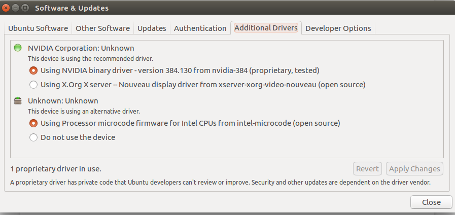
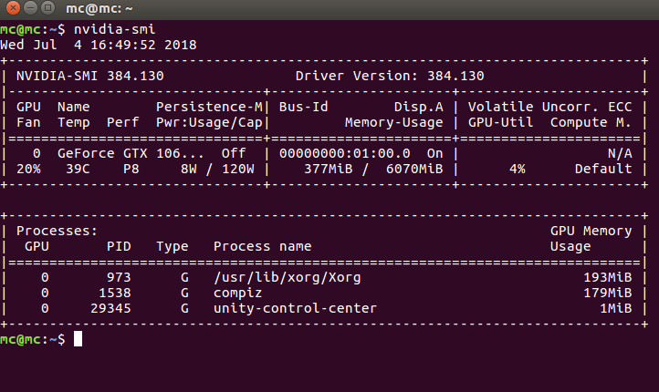
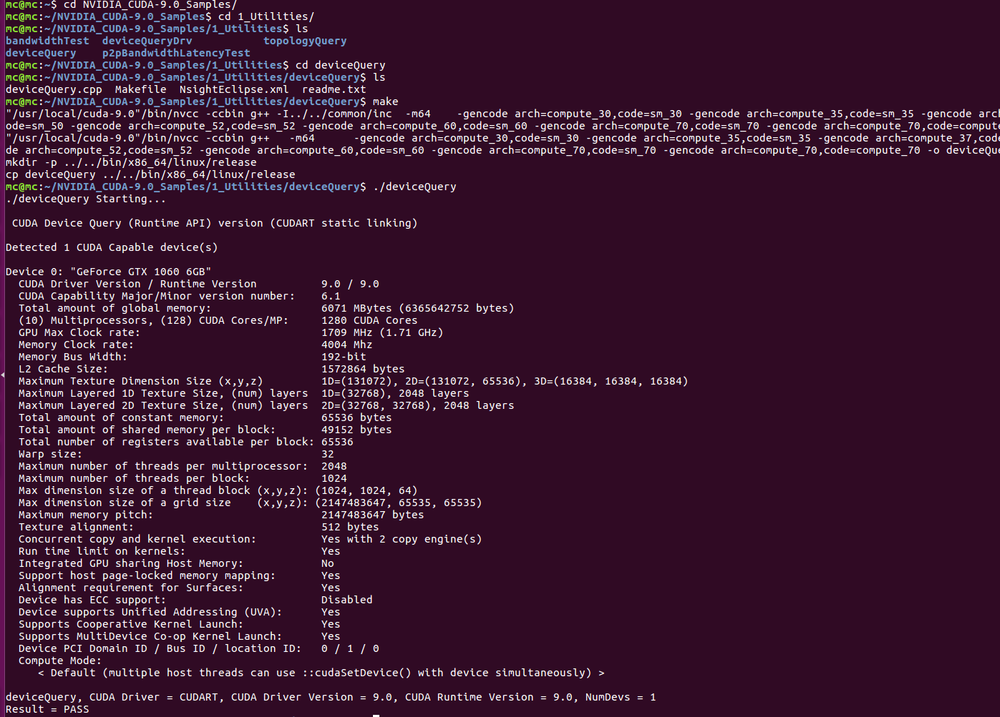
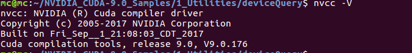
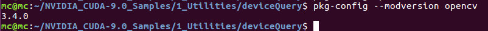
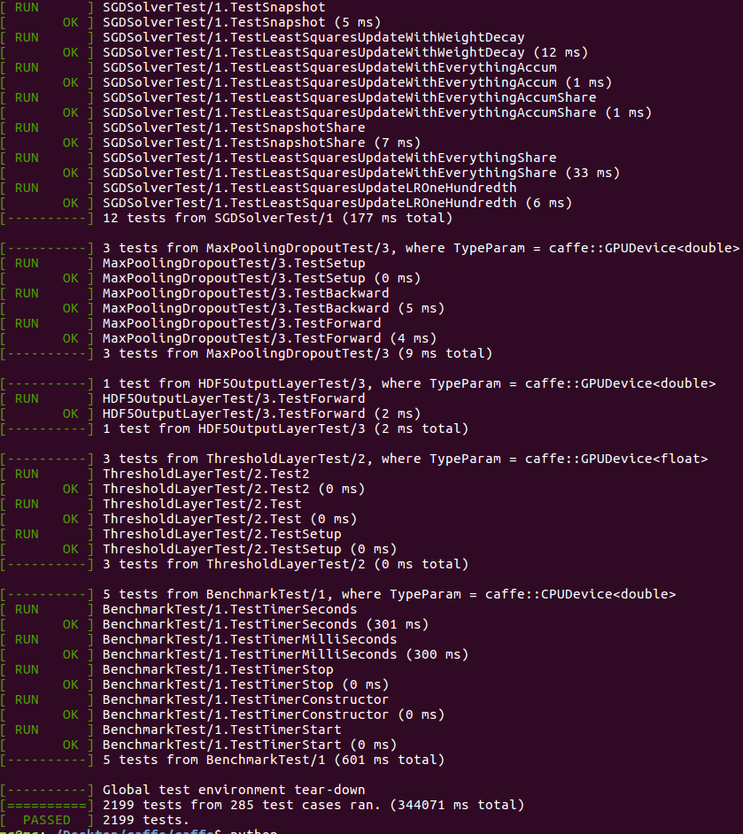

**本教程适用于CUDA9.0+CUDNN7.1+OPENCV(3.4.0)**

## 一、依赖包安装

 在Ubuntu的Terminal中输入：
``` bash
sudo apt-get install libprotobuf-dev libleveldb-dev libsnappy-dev libopencv-dev libhdf5-serial-dev protobuf-compiler
sudo apt-get install --no-install-recommends libboost-all-dev
sudo apt-get install libopenblas-dev liblapack-dev libatlas-base-dev
sudo apt-get install libgflags-dev libgoogle-glog-dev liblmdb-dev
```


## 二、驱动安装(Nvidia 384.X版本的驱动)
方式一
在Terminal输入：
``` bash
sudo apt-get update  
sudo add-apt-repository ppa:graphics-drivers/ppa 
sudo apt-get update 
sudo apt-get install nvidia-384 
sudo apt-get install mesa-common-dev 
sudo apt-getinstall freeglut3-dev
```
方式二
直接在Ubuntu中的System Settings-->Software&Updates中的additional drivers：

驱动安装成功的标志：


## 三、CUDA9.0安装
请通过官网下载CUDA安装文件（.run文件)，运行文件命令如下：
``` bash
# 先CD至.run文件的文件夹，再运行该命令
sudo sh cuda_9.0.176_384.81_linux.run
```
先按q直接跳过阅读协议，然后accept，后面的除了Install NVIDIA Accelerated Graphics Driver for Linux-x86_64 384.81?这样的选n,其它的有y选y，或者直接回车默认
检查一下环境变量
``` bash
gedit ~/.bashr
```
末尾添加
``` bash
#cuda
export LD_LIBRARY_PATH=/usr/local/cuda-9.0/lib64/:$LD_LIBRARY_PATH
export PATH=/usr/local/cuda-9.0/bin:$PATH
```
然后激活
``` bash
source ~/.bashrc
```
检验安装是否完整：


## 四、CUDNN7.1安装
请通过官网下载CUDNN安装文件（.tgz文件)，直接在Terminal中cd至所在文件夹，运行以下命令：
``` bash
tar -zxvf cudnn-9.0-linux-x64-v7.1.tgz 
sudo cp cuda/include/cudnn.h /usr/local/cuda/include/ 
sudo cp cuda/lib64/libcudnn* /usr/local/cuda/lib64/ -d 
sudo chmod a+r /usr/local/cuda/include/cudnn.h 
sudo chmod a+r /usr/local/cuda/lib64/libcudnn*
```
检验是否安装完整：


## 五、Opencv源码编译安装
将下载好的opencv源码（.zip文件）解压缩至home文件夹下，然后在Terminal中输入：
``` bash
cd ~/opencv-3.4.1
mkdir build 
cd build 
cmake -D CMAKE_BUILD_TYPE=Release .. 
sudo make -j8
sudo make install
```
安装完后检验:


## 六、Caffe安装
此处我直接安装到home目录，执行：
``` bash
cd ~ 
git clone https://github.com/BVLC/caffe.git #开始clone 
```
等待下载结束，下载结束后在你的home路径下会存在，caffe文件夹。接下来进入caffe并开始配置caffe，配置如下:
``` bash
sudo cp Makefile.config.example Makefile.config
sudo gedit Makefile.config #或者sudo vim Makefile.config
```
修改Makefile.config内容：
``` bash
将：
#USE_CUDNN := 1
修改为： 
USE_CUDNN := 1

将：
#OPENCV_VERSION := 3 
修改为： 
OPENCV_VERSION := 3

将：
#WITH_PYTHON_LAYER := 1
修改为
WITH_PYTHON_LAYER := 1

将：
INCLUDE_DIRS := $(PYTHON_INCLUDE) /usr/local/include
LIBRARY_DIRS := $(PYTHON_LIB) /usr/local/lib /usr/lib
修改为：
INCLUDE_DIRS := $(PYTHON_INCLUDE) /usr/local/include /usr/include/hdf5/serial
LIBRARY_DIRS := $(PYTHON_LIB) /usr/local/lib /usr/lib /usr/lib/x86_64-linux-gnu /usr/lib/x86_64-linux-gnu/hdf5/serial

将
# CUDA architecture setting: going with all of them.
# For CUDA &lt; 6.0, comment the *_50 through *_61 lines for compatibility.
# For CUDA &lt; 8.0, comment the *_60 and *_61 lines for compatibility.
# For CUDA &gt;= 9.0, comment the *_20 and *_21 lines for compatibility.
CUDA_ARCH := -gencode arch=compute_20,code=sm_20 \
           -gencode arch=compute_20,code=sm_21 \
           -gencode arch=compute_30,code=sm_30 \
           -gencode arch=compute_35,code=sm_35 \
           -gencode arch=compute_50,code=sm_50 \
           -gencode arch=compute_52,code=sm_52 \
           -gencode arch=compute_60,code=sm_60 \
           -gencode arch=compute_61,code=sm_61 \
           -gencode arch=compute_61,code=compute_61

改为：
# CUDA architecture setting: going with all of them.
# For CUDA &lt; 6.0, comment the *_50 through *_61 lines for compatibility.
# For CUDA &lt; 8.0, comment the *_60 and *_61 lines for compatibility.
# For CUDA &gt;= 9.0, comment the *_20 and *_21 lines for compatibility.
CUDA_ARCH := -gencode arch=compute_30,code=sm_30 \
           -gencode arch=compute_35,code=sm_35 \
           -gencode arch=compute_50,code=sm_50 \
           -gencode arch=compute_52,code=sm_52 \
           -gencode arch=compute_60,code=sm_60 \
           -gencode arch=compute_61,code=sm_61 \
           -gencode arch=compute_61,code=compute_61

```
修改Makefile文件：
``` bash
将：
NVCCFLAGS +=-ccbin=$(CXX) -Xcompiler-fPIC $(COMMON_FLAGS)
替换为：
NVCCFLAGS += -D_FORCE_INLINES -ccbin=$(CXX) -Xcompiler -fPIC $(COMMON_FLAGS)

将：
LIBRARIES += glog gflags protobuf boost_system boost_filesystem m hdf5_hl hdf5
改为：
LIBRARIES += glog gflags protobuf boost_system boost_filesystem m hdf5_serial_hl hdf5_serial
```
配置完好之后开始编译：
``` bash
cd caffe
sudo make clean
sudo make all #或者make all -j4(代表4核，或者j8)
sudo make test
sudo make runtest #或者sudo make runtest -j8
sudo make pycaffe
```
检验是否安装完整：

所有的test中，如果编译不报错，则说明安装完整。
